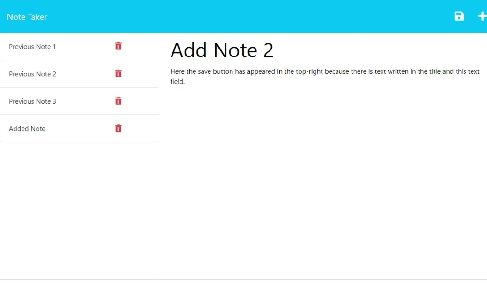

# Note Taker

## Description
This is application allows the user to write and save notes.

## Table of Contents
- [Installation](#installation)
- [Usage](#usage)
- [Questions](#questions)
- [Acknowledgements](#acknowledgements)
- [Preview](#preview)

  
## Installation
1) Download repository
2) Run 'npm install' in command prompt after downloading

## Usage
When the user opens the application, there are presented with a landing page with a link to a notes page. When the user clicks on this link, they are presented with a page that has existing notes listed in the left-hand column, plus empty fields to enter a new note title and the note’s text in the right-hand column. When the user enters text into both the title and note text fields, a save icon will appear. The user can click on this to save the note with the other existing notes on the left hand column. The user can also click on the trash can icon next to it's respective note to remove it from the note list.

## Questions
Questions can be received on the [Github Repository](https://github.com/Wald14/note-taker) for this application. Please make a new issue.

## Acknowledgements
- Gary Almes (Professor)
- Ben Martin and Katy Vincent (TA)
- [W3School](https://www.w3schools.com/)
- [MDN Web Docs](https://developer.mozilla.org/)
- [Stack Overflow](https://stackoverflow.com)

## Preview
A video of the application in use can be accessed [here](https://drive.google.com/file/d/1es2AMdXhh64xJ9_d6tBEhON859k4ubGb/view). The following images share the application's apperance:

